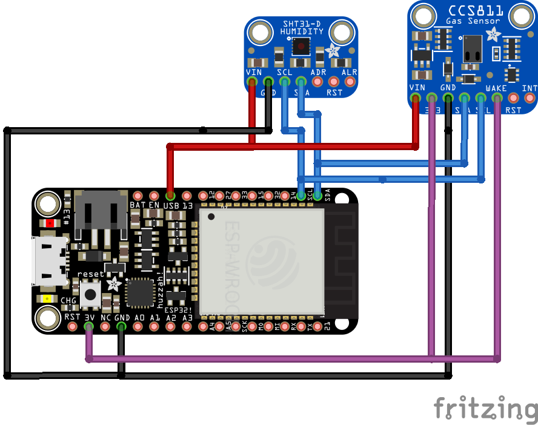

# Environmental Monitor

My home environmental monitor system.

## BOM

- [Adafruit HUZZAH32 – ESP32 Feather Board](https://www.adafruit.com/product/3591)
- [PM2.5 Air Quality Sensor and Breadboard Adapter Kit - PMS5003](https://www.adafruit.com/product/3686)
- [Adafruit Sensirion SHT31-D - Temperature & Humidity Sensor](https://www.adafruit.com/product/2857)
- [Adafruit CCS811 Air Quality Sensor Breakout - VOC and eCO2](https://www.adafruit.com/product/3566)

## Live Monitoring

[Adafruit IO](https://io.adafruit.com/sjkelly/dashboards/env-monitor)

## Wiring

## Notes on Sensors

This is still WIP, but some early observations.

### CCS811 - eCO2 and VOC

- needs a temperature and humidity measurement to have accuracy.
- the onboard temperature is no good.
- tends to fluctuate the first 48 hours after startup.

### SHT31

- Has onboard heater to reduce accumulated condensation
- Temp and Humidity oscillate, symptom of the above?
- Frequency to trigger heater?

## PM2.5 Sensor

Has several readings. Currently using PM standard. Also has environmental and PPM/0.1L.
Will it run off the 3.7V battery?

## ESP32

I used some tricks from [this article](https://savjee.be/2019/12/esp32-tips-to-increase-battery-life/). The ESP32 runs notably cooler
to the touch with a lower frequency and BT off.

## Observations

So far I have tested in my room.

### CO2
Unfortunately one of my room windows is right below a chimney. We burn natural gas here. There
are distinct spikes in CO2 detected if this window is open and the boiler is running. There
are similar rises when the gas stove is in use in the kitchen.

Overnight C02 levels also rise to around 1500PPM, unless a window is cracked in which case they are around 600-1000PPM.
Working from home, I spend easily 18-22 hours a day in my room. Air circulation is quite good and the CO2 levels generally stay
under 1000PPM. Nominal values seem to be around 600-800.

I have 7 house plants; spider, sanservia, bamboo, and pothos varieties. Only two are full size. I'd like to see how watering cycles
and growth affect CO2, and how quantity of plants affect the rate of drop in CO2.

### PM2.5
I have a HEPA filter over my AC and a standalone Coway filter. Both seem to keep PM2.5 <0.2.
I am curious to see how this changes in the winter when only the Coway is running.
